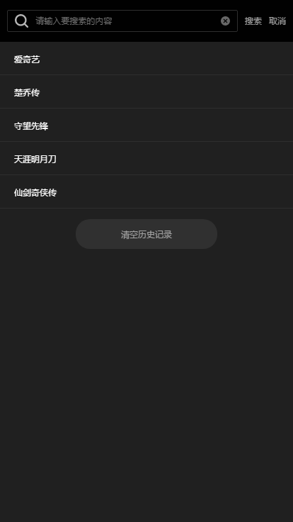
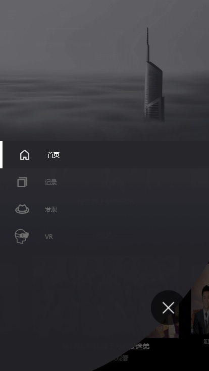
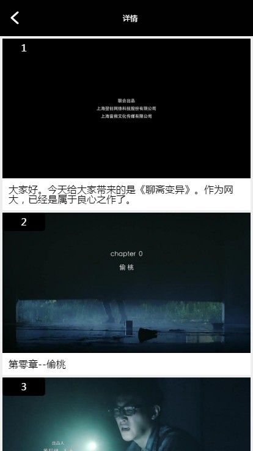

# 简介

《点视》是一款基于 React.js 开发的聚合类影视 Web App，聚合了爱奇艺的视频资源，并保持及时同步更新片源。覆盖片源包括但不限于各类影视大片、热门电视剧、人气动漫、热播综艺、爆笑视频等。用户操作体验轻便指定性强，不繁琐。支持在线观看、全网搜索、影视排行等功能，是专为用户打造最前沿的移动影院播放产品。

# 使用方法

1. git clone https://github.com/Sakitama/dianshi.git
1. npm install -g serve
1. cd dianshi
1. serve -s build
1. 在浏览器中打开 http://localhost:5000/
1. enjoy it!

# 注意事项

需要本地安装爱奇艺客户端，点击想看的视频会自动调起爱奇艺客户端进行播放。

# 运行效果图

## 启动图

## 首页推荐

## 频道列表

## 频道详情

## 搜索

## 搜索结果展示

## 历史搜索词列表

## 更多

## 观看历史记录

## 发现

## 发现文章内容展示

## 快看，以图文的形式快速看完一部电影

## 快看电影内容

## VR

## VR效果

